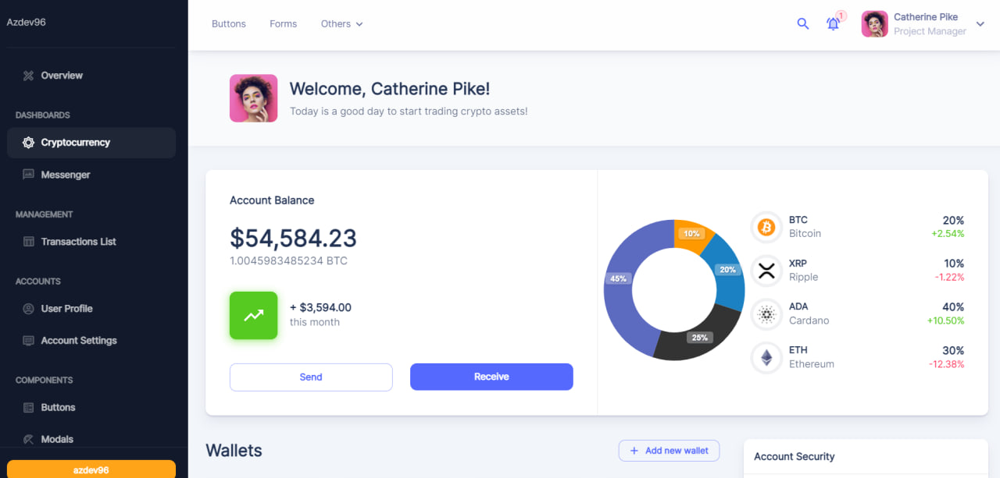

<h1>AdminPanel</h1>

<h2>DEMO Version</h2>

<h3>Использованные техналоги</h3>
<ul>
    <li>react js</li>
    <li>typescript</li>
    <li>react-query</li>
    <li>redux-toolkit</li>
    <li>react-redux</li>
    <li>styled-components</li>
    <li>chart js</li>
    <li>react-hook-form</li>
    <li>mui</li>
</ul>

## Устанавливаем зависимости
npm install && yarn install

## Завпускаем в dev режим 
npm start && yarn start 